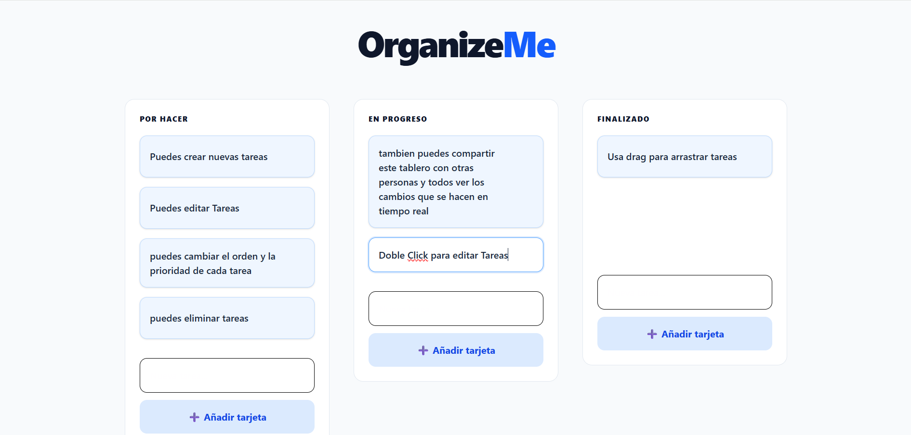
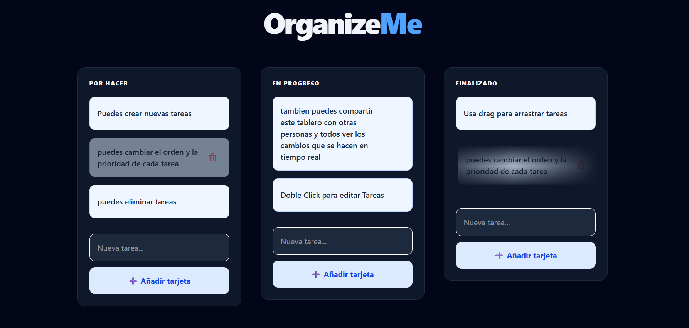

# 🚀 OrganizeMe - Kanban Board Real-Time

<div align="center">
  


<br />




<p><i>Gestión de tareas eficiente con sincronización en la nube y persistencia de datos en tiempo real.</i></p>

[🌐 Ver Demo en Vivo](https://organize-me-gules.vercel.app/)

</div>

---

## 📋 Descripción

**OrganizeMe** es una aplicación de gestión de proyectos inspirada en Trello, diseñada para ayudar a los usuarios a organizar sus tareas de forma visual y fluida. Utiliza una arquitectura moderna basada en componentes y una base de datos NoSQL para garantizar que los cambios se reflejen al instante en todos los dispositivos conectados.

## ✨ Características Principales

- **Sincronización Real-Time:** Gracias a Firebase Realtime Database, cualquier cambio (crear, editar, mover o borrar) se actualiza en vivo.
- **Drag & Drop Nativo:** Movimiento intuitivo de tareas entre columnas (Pendiente, En Progreso, Finalizado) mediante la API de arrastre de HTML5.
- **Arquitectura Modular:** Uso de **Custom Hooks** (`useTablero`) para separar la lógica de negocio de la interfaz de usuario.
- **Diseño Responsive:** Construido con **Tailwind CSS**, adaptándose perfectamente a pantallas de móviles y escritorio.
- **Edición in-place:** Permite editar el contenido de las tareas haciendo doble clic directamente sobre ellas.

## 🛠️ Stack Tecnológico

- **Frontend:** React 19 (Vite)
- **Estilos:** Tailwind CSS
- **Base de Datos:** Firebase Realtime Database
- **Despliegue:** Vercel

## 💡 Aprendizajes Técnicos

Este proyecto me permitió profundizar en:

1.  **Gestión de Estado Complejo:** Manipulación de objetos anidados en React manteniendo la inmutabilidad.
2.  **Persistencia Cloud:** Implementación de listeners asíncronos (`onValue`) para manejar flujos de datos externos.
3.  **Clean Code:** Refactorización de código hacia una estructura de Hooks personalizados para mejorar la mantenibilidad.
4.  **Seguridad:** Manejo de variables de entorno (`.env`) para proteger credenciales sensibles.

## 🚀 Instalación Local

1.  **Clonar repositorio:**
    ```bash
    git clone [https://github.com/tu-usuario/nombre-del-repo.git](https://github.com/tu-usuario/nombre-del-repo.git)
    ```
2.  **Instalar dependencias:**
    ```bash
    npm install
    ```
3.  **Configurar Variables de Entorno:**
    Crea un archivo `.env` en la raíz con tus claves de Firebase:
    ```env
    VITE_FIREBASE_API_KEY=tu_key
    VITE_FIREBASE_DATABASE_URL=tu_url
    ... (resto de variables)
    ```
4.  **Iniciar:**
    ```bash
    npm run dev
    ```

---

<div align="center">
Desarrollado con ❤️ para mi Portfolio Profesional.
</div>
